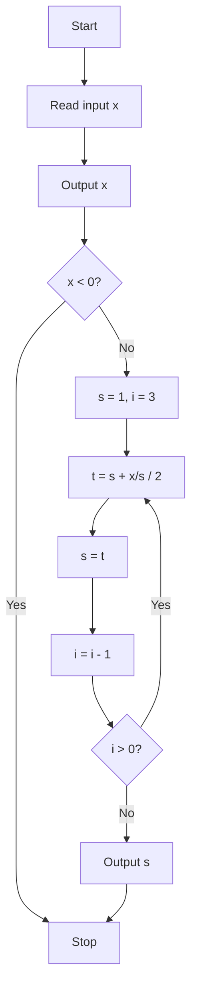

# Analisis y Diseño de Algoritmos Avanzados

#### En esta repo encuentras algoritmos implementados con diversos paradigmas algorítmicos.

Math algorithms

Newton Raphson Algorithm to Calculate the Square root

<ol>
<li>Read a number from the input list, and let x be the name of a memory cell whose initial value is this number.</li>
<li>Write the value in memory cell x. This is called the output.</li>
<li>If the value in x is less than zero, execute instruction 11. Otherwise continue to instruction 4.</li>
<li>Let s be the name of a memory cell whose initial value is 1.</li>
<li>Let i be the name of a memory cell whose initial value is 3.</li>
<li>Calculate the value of (s+(x/s))/2. Let t be the name of a memory cell whose value is the calculated quantity; that is, set t equal to the value of (x+(x/s))/2.</li>
<li>Assign the value in to to memory cell s. That is, set s equal to the value in t and forget the old value associated with s.</li>
<li>Decrease the value in memory cell i by 1.</li>
<li>If the value in i is positive, execute instruction 6. Otherwise, continue to instruction 10.</li>
<li>Write the value in s on the output answer sheet.</li>
<li>Stop; you have finished.</li>
</ol>

# Algoritmos de Comparación

### Bubble Sort
_Código:_ 
- C++ [bubblesort_arreglos.cpp](../algoritmos-comparacion/bubblesort_arreglos.cpp) // Usando arreglos estáticos
- C++ [bubblesort_vectores.cpp](../algoritmos-comparacion/bubblesort_vectores.cpp) // Usando vectores
- C [bubblesort.c](../algoritmos-comparacion/bubblesort.c)
- Python [bubblesort.py](../algoritmos-comparacion/bubblesort.py)
- Racket [bubblesort.rkt](../algoritmos-comparacion/bubblesort.rkt)

### Selection Sort
_Código:_
- C++ [selectionsort_arreglos.cpp](../algoritmos-comparacion/selectionsort_arreglos.cpp) // Usando arreglos estáticos
- C++ [selectionsort_vectores.cpp](../algoritmos-comparacion/selectionsort_vectores.cpp) // Usando vectores
- C [selectionsort.c](../algoritmos-comparacion/selectionsort_c.c)
- Python [selectionsort.py](../algoritmos-comparacion/selectionsort.py)
- Racket [selectionsort.rkt](../algoritmos-comparacion/selectionsort.rkt)

### Insertion Sort
_Código:_
- C++ [insertionsort_arreglos.cpp](../algoritmos-comparacion/insertionsort_arreglos.cpp) // Usando arreglos estáticos
- C++ [insertionsort_vectores.cpp](../algoritmos-comparacion/insertionsort_vectores.cpp) // Usando vectores
- C [insertionsort.c](../algoritmos-comparacion/insertionsort_c.c)
- Python [insertionsort.py](../algoritmos-comparacion/insertionsort.py)
- Racket [insertionsort.rkt](../algoritmos-comparacion/insertionsort.rkt)

### Heap Sort
_Código:_
- C++ [heapsort_arreglos.cpp](../algoritmos-comparacion/heapsort_arreglos.cpp) // Usando arreglos estáticos
- C++ [heapsort_vectores.cpp](../algoritmos-comparacion/heapsort_vectores.cpp) // Usando vectores
- C [heapsort.c](../algoritmos-comparacion/heapsort.c)
- Python [heapsort.py](../algoritmos-comparacion/heapsort.py)
- Racket [heapsort.rkt](../algoritmos-comparacion/heapsort.rkt)

# Algoritmos No-Comparativos

### Counting Sort
_Código:_
- C++ [countingsort.cpp](../algoritmos-no-comparativos/countingsort.cpp)
- C [countingsort.c](../algoritmos-no-comparativos/countingsort.c)
- Python [countingsort.py](../algoritmos-no-comparativos/countingsort.py)
- Racket [countingsort.rkt](../algoritmos-no-comparativos/countingsort.rkt)

### Radix Sort
_Código:_
- C++ [radixsort.cpp](../algoritmos-no-comparativos/radixsort.cpp)
- C [radixsort.c](../algoritmos-no-comparativos/radixsort.c)
- Python [radixsort.py](../algoritmos-no-comparativos/radixsort.py)
- Racket [radixsort.rkt](../algoritmos-no-comparativos/radixsort.rkt)

# Algoritmos Divide y Venceras

### Merge Sort
_Código:_ 
- C++ [mergesort.cpp](../algoritmos-divide-venceras/mergesort.cpp)
- C [mergesort.c](../algoritmos-divide-venceras/mergesort.c)
- Python [mergesort.py](../algoritmos-divide-venceras/mergesort.py)
- Racket [mergesort.rkt](../algoritmos-divide-venceras/mergesort.rkt)

### Quick Sort
_Código:_
- C++ [quicksort.cpp](../algoritmos-divide-venceras/quicksort.cpp)
- C [quicksort.c](../algoritmos-divide-venceras/quicksort.c)
- Python [quicksort.py](../algoritmos-divide-venceras/quicksort.py)
- Racket [quicksort.rkt](../algoritmos-divide-venceras/quicksort.rkt)

### Ejercicio: Hanoi Towers

##### Explicación y código
- [Torres de Hanoi](https://github.com/feraranas/Analisis-Algoritmos-Avanzados/blob/Torres-de-Hanoi/README.md)

# Algoritmos Programación Dinámica

### Ejercicio: Fibonacci Series

##### Explicación y código
- [Fibonacci Series](https://github.com/feraranas/Analisis-Algoritmos-Avanzados/blob/fibonacci-series/README.md)

### Ejercicio: Ruta más corta por matriz

##### Explicación y código
- [Ruta más corta a traves de Matriz](https://github.com/feraranas/Analisis-Algoritmos-Avanzados/blob/ruta-corta-matriz/README.md)

### Ejercicio: Recolección de dulces

##### Explicación y código
- [Recolección de dulces](https://github.com/feraranas/Analisis-Algoritmos-Avanzados/blob/recoleccion-dulces/README.md)

# Algoritmos Avaros/Codiciosos/Voraces

### Ejercicio: El problema de las monedas

##### Explicación y código
- [El problema de las monedas](https://github.com/feraranas/Analisis-Algoritmos-Avanzados/blob/problema-monedas/README.md)

### Ejercicio: Minimizar el tiempo de espera en una fila

##### Explicación y código
- [Minimizar tiempo de espera en una fila](https://github.com/feraranas/Analisis-Algoritmos-Avanzados/blob/minimizar-tiempo-fila/README.md)

### Ejercicio: Maximización de horas dado limites de tiempo

##### Explicación y código
- [Maximizar de horario](https://github.com/feraranas/Analisis-Algoritmos-Avanzados/blob/maximizar-horario-clase/README.md)

# Algoritmos Backtracking

### Ejercicio: El Problema de las N-Reinas

##### Explicación y código
- [El problema de las N-Reinas](https://github.com/feraranas/Analisis-Algoritmos-Avanzados/blob/problema-n-reinas/README.md)

### Ejercicio: El Raton en el laberinto

##### Explicación y código
- [El raton en el laberinto](https://github.com/feraranas/Analisis-Algoritmos-Avanzados/blob/raton-laberinto/README.md)

### Ejercicio: Sudoku

##### Explicación y código
- [Sudoku](https://github.com/feraranas/Analisis-Algoritmos-Avanzados/blob/sudoku/README.md)

### Ejercicio: Busca la salida del laberinto

##### Explicación y código
- [Busca la salida del laberinto](https://github.com/feraranas/Analisis-Algoritmos-Avanzados/blob/busqueda-salida-laberinto/README.md)

### Ejercicio: Máximo número de compañeros

##### Explicación y código
- [Máximo número de compañeros](https://github.com/feraranas/Analisis-Algoritmos-Avanzados/blob/maximo-numero-companeros/README.md)

### Ejercicio: The knight's tour problem

##### Explicación y código
- [The knight's tour problem](https://github.com/feraranas/Analisis-Algoritmos-Avanzados/blob/knights-tour-problem/README.md)

# Algoritmo KMP-Z

### Ejercicio: Buscando patrones con el algoritmo LPS - KMP

##### Explicación y código
- [Algoritmo KMP](https://github.com/feraranas/Analisis-Algoritmos-Avanzados/blob/kmp/README.md)

# Grafos

### 0. [Flood Fill Algorithm](https://github.com/feraranas/Analisis-Algoritmos-Avanzados/blob/grafos/README.md)

### 1. [Trie](https://github.com/feraranas/Analisis-Algoritmos-Avanzados/blob/grafos/README.md)

### 2. [Compressed Trie](https://github.com/feraranas/Analisis-Algoritmos-Avanzados/blob/grafos/README.md)

### 3. [Binary Search Tree](https://github.com/feraranas/Analisis-Algoritmos-Avanzados/blob/grafos/README.md)

### 4. [Ternary Search Tree](https://github.com/feraranas/Analisis-Algoritmos-Avanzados/blob/grafos/README.md)

### 5. [DOM Diffing Tree](https://www.geeksforgeeks.org/explain-dom-diffing/)
### 5.1 [DOM Diffing Tree 2](https://www.geeksforgeeks.org/what-is-diffing-algorithm/)
### 5.2 [DOM Diffing Tree 3](https://engineering.wingify.com/dom-comparator/the-algorithm)

# Geometria Computacional

### 1. Proximidad e intersección

- [Interseccion y proximidad](https://github.com/feraranas/Analisis-Algoritmos-Avanzados/blob/geometria_computacional/README.md)

### 2. Diagramas de Voronoi y triangulación de Delaunay

- [Diagramas de Voronoi](https://github.com/feraranas/Analisis-Algoritmos-Avanzados/blob/geometria_computacional/README.md)

- [Triangulación de Delaunay](https://github.com/feraranas/Analisis-Algoritmos-Avanzados/blob/geometria_computacional/README.md)

### 3. Búsqueda geométrica

- [Búsqueda geométrica](https://github.com/feraranas/Analisis-Algoritmos-Avanzados/blob/geometria_computacional/README.md)

### 4. Arreglos de hiperplanos

- [Arreglos de hiperplanos](https://github.com/feraranas/Analisis-Algoritmos-Avanzados/blob/geometria_computacional/README.md)

### 5. Cascos convexos, politopos y computación

#### Implementación polígonos convexos usando Método de Graham
- [Graham Mehtod](https://github.com/feraranas/Analisis-Algoritmos-Avanzados/blob/geometria_computacional/README.md)

# Algoritmos aleatorizados

- [Algoritmos aleatorizados](https://github.com/feraranas/Analisis-Algoritmos-Avanzados/blob/algoritmos_aleatorizados/README.md)
