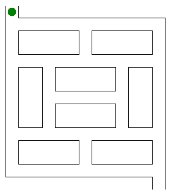

# El raton en el laberinto

Un algoritmo de resolución de laberintos es un método automatizado para resolver un laberinto. Los **algoritmos de ratón**, **seguidor de pared**, **Pledge** y **Trémaux** están diseñados para ser utilizados dentro del laberinto por un viajero _sin conocimiento previo del laberinto_, mientras que los **algoritmos de relleno de callejón sin salida** y **ruta más corta** están diseñados para ser utilizados por una persona o programa de computadora que puede ver todo el laberinto a la vez.

Los laberintos que _no contienen bucles_ se conocen como laberintos "simplemente conectados" o "perfectos", y son equivalentes a un árbol en la teoría de grafos. Los algoritmos de resolución de laberintos están estrechamente relacionados con la teoría de grafos. Intuitivamente, si uno tira y estira los caminos en el laberinto de la manera adecuada, el resultado podría parecerse a un árbol.

_Código:_ 
- C++ [ratonlaberinto.cpp](../raton-laberinto/ratonlaberinto.cpp)
- C [ratonlaberinto.c](../raton-laberinto/ratonlaberinto.c)
- Python [ratonlaberinto.py](../raton-laberinto/ratonlaberinto.py)
- Racket [ratonlaberinto.rkt](../raton-laberinto/ratonlaberinto.rkt)
